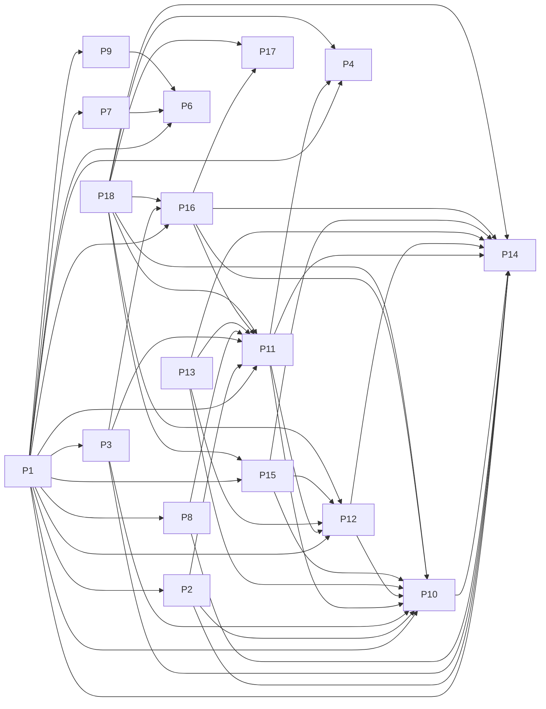

# Projects and dependencies analysis

This document provides a comprehensive overview of the projects and their dependencies in the context of upgrading to .NETCoreApp,Version=v10.0.

## Table of Contents

- [Executive Summary](#executive-Summary)
  - [Highlevel Metrics](#highlevel-metrics)
  - [Projects Compatibility](#projects-compatibility)
  - [Package Compatibility](#package-compatibility)
  - [API Compatibility](#api-compatibility)
  - [Binding Redirect Configuration](#binding-redirect-configuration)
- [Aggregate NuGet packages details](#aggregate-nuget-packages-details)
- [Top API Migration Challenges](#top-api-migration-challenges)
  - [Technologies and Features](#technologies-and-features)
  - [Most Frequent API Issues](#most-frequent-api-issues)
- [Projects Relationship Graph](#projects-relationship-graph)
- [Project Details](#project-details)

  - [BugNET_WAP/BugNET_WAP.csproj](#bugnet_wapbugnet_wapcsproj)
  - [BugNET.BLL/BugNET.BLL.csproj](#bugnetbllbugnetbllcsproj)
  - [BugNET.Common/BugNET.Common.csproj](#bugnetcommonbugnetcommoncsproj)
  - [BugNET.DAL/BugNET.DAL.csproj](#bugnetdalbugnetdalcsproj)
  - [BugNET.Entities/BugNET.Entities.csproj](#bugnetentitiesbugnetentitiescsproj)
  - [BugNET.MailboxReader.Tests/BugNET.MailboxReader.Tests.csproj](#bugnetmailboxreadertestsbugnetmailboxreadertestscsproj)
  - [BugNET.MailboxReader/BugNET.MailboxReader.csproj](#bugnetmailboxreaderbugnetmailboxreadercsproj)
  - [BugNET.MercurialChangeGroupHook/BugNET.MercurialChangeGroupHook.csproj](#bugnetmercurialchangegrouphookbugnetmercurialchangegrouphookcsproj)
  - [BugNET.SubversionHooks/BugNET.SubversionHooks.csproj](#bugnetsubversionhooksbugnetsubversionhookscsproj)
  - [BugNET.Tests/BugNET.Tests.csproj](#bugnettestsbugnettestscsproj)
  - [Library/HttpModules/Authentication/HttpModule.Authentication.csproj](#libraryhttpmodulesauthenticationhttpmoduleauthenticationcsproj)
  - [Library/HttpModules/Localization/HttpModule.Localization.csproj](#libraryhttpmoduleslocalizationhttpmodulelocalizationcsproj)
  - [Library/HttpModules/MailBoxReader/HttpModule.MailBoxReader.csproj](#libraryhttpmodulesmailboxreaderhttpmodulemailboxreadercsproj)
  - [Library/Providers/DataProviders/SqlDataProvider/Provider.SqlDataProvider.csproj](#libraryprovidersdataproviderssqldataproviderprovidersqldataprovidercsproj)
  - [Library/Providers/HtmlEditorProviders/CkHtmlEditorProvider/Provider.CkHtmlEditorProvider.csproj](#libraryprovidershtmleditorprovidersckhtmleditorproviderproviderckhtmleditorprovidercsproj)
  - [Library/Providers/HtmlEditorProviders/HtmlEditorProvider/Provider.HtmlEditorProvider.csproj](#libraryprovidershtmleditorprovidershtmleditorproviderproviderhtmleditorprovidercsproj)
  - [Library/Providers/HtmlEditorProviders/TextboxHtmlProvider/Provider.TextboxHtmlProvider.csproj](#libraryprovidershtmleditorproviderstextboxhtmlproviderprovidertextboxhtmlprovidercsproj)
  - [Library/Providers/MembershipProviders/Provider.MembershipProviders.csproj](#libraryprovidersmembershipprovidersprovidermembershipproviderscsproj)
  - [LumiSoft.Net/LumiSoft.Net.csproj](#lumisoftnetlumisoftnetcsproj)

## Executive Summary

### Highlevel Metrics

| Metric | Count | Status |
| :--- | :---: | :--- |
| Total Projects | 19 | All require upgrade |
| Total NuGet Packages | 51 | 38 need upgrade |
| Total Code Files | 754 |  |
| Total Code Files with Incidents | 21 |  |
| Total Lines of Code | 28630 |  |
| Total Number of Issues | 138 |  |
| Estimated LOC to modify | 0+ | at least 0.0% of codebase |

### Projects Compatibility

| Project | Target Framework | Difficulty | Package Issues | API Issues | Binding Issues | Est. LOC Impact | Description |
| :--- | :---: | :---: | :---: | :---: | :---: | :---: | :--- |
| [BugNET_WAP/BugNET_WAP.csproj](#bugnet_wapbugnet_wapcsproj) | net45 | 🔴 High | 47 | 0 | 6 |  | Wap, Sdk Style = False |
| [BugNET.BLL/BugNET.BLL.csproj](#bugnetbllbugnetbllcsproj) | net45 | 🟢 Low | 1 | 0 | 1 |  | ClassicClassLibrary, Sdk Style = False |
| [BugNET.Common/BugNET.Common.csproj](#bugnetcommonbugnetcommoncsproj) | net45 | 🟢 Low | 1 | 0 | 1 |  | ClassicClassLibrary, Sdk Style = False |
| [BugNET.DAL/BugNET.DAL.csproj](#bugnetdalbugnetdalcsproj) | net45 | 🟢 Low | 1 | 0 | 1 |  | ClassicClassLibrary, Sdk Style = False |
| [BugNET.Entities/BugNET.Entities.csproj](#bugnetentitiesbugnetentitiescsproj) | net45 | 🟢 Low | 3 | 0 | 1 |  | ClassicClassLibrary, Sdk Style = False |
| [BugNET.MailboxReader.Tests/BugNET.MailboxReader.Tests.csproj](#bugnetmailboxreadertestsbugnetmailboxreadertestscsproj) | net45 | 🟢 Low | 2 | 0 | 2 |  | ClassicClassLibrary, Sdk Style = False |
| [BugNET.MailboxReader/BugNET.MailboxReader.csproj](#bugnetmailboxreaderbugnetmailboxreadercsproj) | net45 | 🟢 Low | 2 | 0 | 1 |  | ClassicClassLibrary, Sdk Style = False |
| [BugNET.MercurialChangeGroupHook/BugNET.MercurialChangeGroupHook.csproj](#bugnetmercurialchangegrouphookbugnetmercurialchangegrouphookcsproj) | net45 | 🟢 Low | 2 | 0 | 1 |  | ClassicDotNetApp, Sdk Style = False |
| [BugNET.SubversionHooks/BugNET.SubversionHooks.csproj](#bugnetsubversionhooksbugnetsubversionhookscsproj) | net45 | 🟢 Low | 1 | 0 | 1 |  | ClassicDotNetApp, Sdk Style = False |
| [BugNET.Tests/BugNET.Tests.csproj](#bugnettestsbugnettestscsproj) | net45 | 🟢 Low | 2 | 0 | 2 |  | ClassicClassLibrary, Sdk Style = False |
| [Library/HttpModules/Authentication/HttpModule.Authentication.csproj](#libraryhttpmodulesauthenticationhttpmoduleauthenticationcsproj) | net45 | 🟢 Low | 1 | 0 | 1 |  | ClassicClassLibrary, Sdk Style = False |
| [Library/HttpModules/Localization/HttpModule.Localization.csproj](#libraryhttpmoduleslocalizationhttpmodulelocalizationcsproj) | net45 | 🟢 Low | 1 | 0 | 1 |  | ClassicClassLibrary, Sdk Style = False |
| [Library/HttpModules/MailBoxReader/HttpModule.MailBoxReader.csproj](#libraryhttpmodulesmailboxreaderhttpmodulemailboxreadercsproj) | net45 | 🟢 Low | 1 | 0 | 1 |  | ClassicClassLibrary, Sdk Style = False |
| [Library/Providers/DataProviders/SqlDataProvider/Provider.SqlDataProvider.csproj](#libraryprovidersdataproviderssqldataproviderprovidersqldataprovidercsproj) | net45 | 🟢 Low | 1 | 0 | 1 |  | ClassicClassLibrary, Sdk Style = False |
| [Library/Providers/HtmlEditorProviders/CkHtmlEditorProvider/Provider.CkHtmlEditorProvider.csproj](#libraryprovidershtmleditorprovidersckhtmleditorproviderproviderckhtmleditorprovidercsproj) | net45 | 🟢 Low | 1 | 0 | 1 |  | ClassicClassLibrary, Sdk Style = False |
| [Library/Providers/HtmlEditorProviders/HtmlEditorProvider/Provider.HtmlEditorProvider.csproj](#libraryprovidershtmleditorprovidershtmleditorproviderproviderhtmleditorprovidercsproj) | net45 | 🟢 Low | 1 | 0 | 1 |  | ClassicClassLibrary, Sdk Style = False |
| [Library/Providers/HtmlEditorProviders/TextboxHtmlProvider/Provider.TextboxHtmlProvider.csproj](#libraryprovidershtmleditorproviderstextboxhtmlproviderprovidertextboxhtmlprovidercsproj) | net45 | 🟢 Low | 1 | 0 | 1 |  | ClassicClassLibrary, Sdk Style = False |
| [Library/Providers/MembershipProviders/Provider.MembershipProviders.csproj](#libraryprovidersmembershipprovidersprovidermembershipproviderscsproj) | net45 | 🟢 Low | 4 | 0 | 1 |  | ClassicClassLibrary, Sdk Style = False |
| [LumiSoft.Net/LumiSoft.Net.csproj](#lumisoftnetlumisoftnetcsproj) | net40 | 🟢 Low | 0 | 0 | 1 |  | ClassicWinForms, Sdk Style = False |

### Package Compatibility

| Status | Count | Percentage |
| :--- | :---: | :---: |
| ✅ Compatible | 13 | 25.5% |
| ⚠️ Incompatible | 33 | 64.7% |
| 🔄 Upgrade Recommended | 5 | 9.8% |
| ***Total NuGet Packages*** | ***51*** | ***100%*** |

### API Compatibility

| Category | Count | Impact |
| :--- | :---: | :--- |
| 🔴 Binary Incompatible | 0 | High - Require code changes |
| 🟡 Source Incompatible | 0 | Medium - Needs re-compilation and potential conflicting API error fixing |
| 🔵 Behavioral change | 0 | Low - Behavioral changes that may require testing at runtime |
| ✅ Compatible | 22168 |  |
| ***Total APIs Analyzed*** | ***22168*** |  |

### Binding Redirect Configuration

| Severity | Count | Description |
| :--- | :---: | :--- |
| 🟡Potential | 26 | May cause issues in certain scenarios |
| ***Total Binding Issues*** | ***26*** | ***Across 19 project(s)*** |

## Aggregate NuGet packages details

| Package | Current Version | Suggested Version | Projects | Description |
| :--- | :---: | :---: | :--- | :--- |
| AjaxControlToolkit | 15.1.4.0 |  | [BugNET_WAP.csproj](#bugnet_wapbugnet_wapcsproj) | ⚠️NuGet package is incompatible |
| AjaxMin | 5.14.5506.26202 |  | [BugNET_WAP.csproj](#bugnet_wapbugnet_wapcsproj) | ⚠️NuGet package is incompatible |
| Antlr | 3.5.0.2 |  | [BugNET_WAP.csproj](#bugnet_wapbugnet_wapcsproj) | Needs to be replaced with Replace with new package Antlr4=4.6.6 |
| AspNet.ScriptManager.bootstrap | 3.3.6 |  | [BugNET_WAP.csproj](#bugnet_wapbugnet_wapcsproj) | ⚠️NuGet package is incompatible |
| AspNet.ScriptManager.jQuery | 2.1.4 |  | [BugNET_WAP.csproj](#bugnet_wapbugnet_wapcsproj) | ⚠️NuGet package is incompatible |
| AspNet.ScriptManager.jQuery.UI.Combined | 1.11.4 |  | [BugNET_WAP.csproj](#bugnet_wapbugnet_wapcsproj) | ⚠️NuGet package is incompatible |
| AutoMapper | 3.2.1 | 16.2.0 | [BugNET.Entities.csproj](#bugnetentitiesbugnetentitiescsproj) | ⚠️NuGet package is incompatible |
| bootstrap | 3.3.6 | 5.3.8 | [BugNET_WAP.csproj](#bugnet_wapbugnet_wapcsproj) | NuGet package contains security vulnerability |
| CKEditor | 3.6.4 |  | [Provider.CkHtmlEditorProvider.csproj](#libraryprovidershtmleditorprovidersckhtmleditorproviderproviderckhtmleditorprovidercsproj) | ✅Compatible |
| CkeditorForASP.NET | 3.6.4.0 |  | [Provider.CkHtmlEditorProvider.csproj](#libraryprovidershtmleditorprovidersckhtmleditorproviderproviderckhtmleditorprovidercsproj) | ✅Compatible |
| DotNetOpenAuth.AspNet | 4.3.4.13329 |  | [BugNET_WAP.csproj](#bugnet_wapbugnet_wapcsproj) | ⚠️NuGet package is incompatible |
| DotNetOpenAuth.Core | 4.3.4.13329 |  | [BugNET_WAP.csproj](#bugnet_wapbugnet_wapcsproj) | ⚠️NuGet package is incompatible |
| DotNetOpenAuth.GoogleOAuth2 | 1.1.2 |  | [BugNET_WAP.csproj](#bugnet_wapbugnet_wapcsproj) | ⚠️NuGet package is incompatible |
| DotNetOpenAuth.OAuth.Consumer | 4.3.4.13329 |  | [BugNET_WAP.csproj](#bugnet_wapbugnet_wapcsproj) | ⚠️NuGet package is incompatible |
| DotNetOpenAuth.OAuth.Core | 4.3.4.13329 |  | [BugNET_WAP.csproj](#bugnet_wapbugnet_wapcsproj) | ⚠️NuGet package is incompatible |
| DotNetOpenAuth.OpenId.Core | 4.3.4.13329 |  | [BugNET_WAP.csproj](#bugnet_wapbugnet_wapcsproj) | ⚠️NuGet package is incompatible |
| DotNetOpenAuth.OpenId.RelyingParty | 4.3.4.13329 |  | [BugNET_WAP.csproj](#bugnet_wapbugnet_wapcsproj) | ⚠️NuGet package is incompatible |
| EntityFramework | 6.1.3 | 6.5.2 | [BugNET_WAP.csproj](#bugnet_wapbugnet_wapcsproj) [Provider.MembershipProviders.csproj](#libraryprovidersmembershipprovidersprovidermembershipproviderscsproj) | NuGet package upgrade is recommended |
| FontAwesome | 4.4.0 |  | [BugNET_WAP.csproj](#bugnet_wapbugnet_wapcsproj) | ✅Compatible |
| HtmlAgilityPack | 1.4.9 | 1.12.4 | [BugNET_WAP.csproj](#bugnet_wapbugnet_wapcsproj) [BugNET.MailboxReader.csproj](#bugnetmailboxreaderbugnetmailboxreadercsproj) | ⚠️NuGet package is incompatible |
| jQuery | 2.1.4 | 3.7.1 | [BugNET_WAP.csproj](#bugnet_wapbugnet_wapcsproj) | NuGet package contains security vulnerability |
| jQuery.UI.Combined | 1.11.4 | 1.14.1 | [BugNET_WAP.csproj](#bugnet_wapbugnet_wapcsproj) | NuGet package contains security vulnerability |
| json2 | 1.0.2 |  | [BugNET_WAP.csproj](#bugnet_wapbugnet_wapcsproj) | ✅Compatible |
| log4net | 2.0.5 | 3.3.2 | [BugNET_WAP.csproj](#bugnet_wapbugnet_wapcsproj) [BugNET.BLL.csproj](#bugnetbllbugnetbllcsproj) [BugNET.Common.csproj](#bugnetcommonbugnetcommoncsproj) [BugNET.DAL.csproj](#bugnetdalbugnetdalcsproj) [BugNET.Entities.csproj](#bugnetentitiesbugnetentitiescsproj) [BugNET.MailboxReader.csproj](#bugnetmailboxreaderbugnetmailboxreadercsproj) [BugNET.MailboxReader.Tests.csproj](#bugnetmailboxreadertestsbugnetmailboxreadertestscsproj) [BugNET.MercurialChangeGroupHook.csproj](#bugnetmercurialchangegrouphookbugnetmercurialchangegrouphookcsproj) [BugNET.SubversionHooks.csproj](#bugnetsubversionhooksbugnetsubversionhookscsproj) [BugNET.Tests.csproj](#bugnettestsbugnettestscsproj) [HttpModule.Authentication.csproj](#libraryhttpmodulesauthenticationhttpmoduleauthenticationcsproj) [HttpModule.Localization.csproj](#libraryhttpmoduleslocalizationhttpmodulelocalizationcsproj) [HttpModule.MailBoxReader.csproj](#libraryhttpmodulesmailboxreaderhttpmodulemailboxreadercsproj) [Provider.CkHtmlEditorProvider.csproj](#libraryprovidershtmleditorprovidersckhtmleditorproviderproviderckhtmleditorprovidercsproj) [Provider.HtmlEditorProvider.csproj](#libraryprovidershtmleditorprovidershtmleditorproviderproviderhtmleditorprovidercsproj) [Provider.MembershipProviders.csproj](#libraryprovidersmembershipprovidersprovidermembershipproviderscsproj) [Provider.SqlDataProvider.csproj](#libraryprovidersdataproviderssqldataproviderprovidersqldataprovidercsproj) [Provider.TextboxHtmlProvider.csproj](#libraryprovidershtmleditorproviderstextboxhtmlproviderprovidertextboxhtmlprovidercsproj) | ⚠️NuGet package is incompatible |
| Mercurial.Net | 1.1.1.607 |  | [BugNET.MercurialChangeGroupHook.csproj](#bugnetmercurialchangegrouphookbugnetmercurialchangegrouphookcsproj) | ⚠️NuGet package is incompatible |
| Microsoft.AspNet.FriendlyUrls | 1.0.2 |  | [BugNET_WAP.csproj](#bugnet_wapbugnet_wapcsproj) | ⚠️NuGet package is incompatible |
| Microsoft.AspNet.FriendlyUrls.Core | 1.0.2 |  | [BugNET_WAP.csproj](#bugnet_wapbugnet_wapcsproj) | ⚠️NuGet package is incompatible |
| Microsoft.AspNet.Membership.OpenAuth | 2.0.1 |  | [BugNET_WAP.csproj](#bugnet_wapbugnet_wapcsproj) | ⚠️NuGet package is incompatible |
| Microsoft.AspNet.Providers | 2.0.0 |  | [BugNET_WAP.csproj](#bugnet_wapbugnet_wapcsproj) [Provider.MembershipProviders.csproj](#libraryprovidersmembershipprovidersprovidermembershipproviderscsproj) | ✅Compatible |
| Microsoft.AspNet.Providers.Core | 2.0.0 |  | [BugNET_WAP.csproj](#bugnet_wapbugnet_wapcsproj) [Provider.MembershipProviders.csproj](#libraryprovidersmembershipprovidersprovidermembershipproviderscsproj) | ⚠️NuGet package is incompatible |
| Microsoft.AspNet.Providers.LocalDB | 2.0.0 |  | [BugNET_WAP.csproj](#bugnet_wapbugnet_wapcsproj) | ✅Compatible |
| Microsoft.AspNet.ScriptManager.MSAjax | 5.0.0 |  | [BugNET_WAP.csproj](#bugnet_wapbugnet_wapcsproj) | ⚠️NuGet package is incompatible |
| Microsoft.AspNet.ScriptManager.WebForms | 5.0.0 |  | [BugNET_WAP.csproj](#bugnet_wapbugnet_wapcsproj) | ⚠️NuGet package is incompatible |
| Microsoft.AspNet.Web.Optimization | 1.1.3 |  | [BugNET_WAP.csproj](#bugnet_wapbugnet_wapcsproj) | ⚠️NuGet package is incompatible |
| Microsoft.AspNet.Web.Optimization.WebForms | 1.1.3 |  | [BugNET_WAP.csproj](#bugnet_wapbugnet_wapcsproj) | ⚠️NuGet package is incompatible |
| Microsoft.Azure.KeyVault.Core | 1.0.0 | 3.0.5 | [BugNET_WAP.csproj](#bugnet_wapbugnet_wapcsproj) | ⚠️NuGet package is incompatible |
| Microsoft.Bcl | 1.1.10 |  | [BugNET_WAP.csproj](#bugnet_wapbugnet_wapcsproj) | ⚠️NuGet package is incompatible |
| Microsoft.Bcl.Build | 1.0.21 |  | [BugNET_WAP.csproj](#bugnet_wapbugnet_wapcsproj) | ✅Compatible |
| Microsoft.Data.Edm | 5.7.0 | 5.8.5 | [BugNET_WAP.csproj](#bugnet_wapbugnet_wapcsproj) | ⚠️Replace with Microsoft.OData.Edm: Use OData v4 model types; adjust EDM model builders |
| Microsoft.Data.OData | 5.7.0 | 5.8.5 | [BugNET_WAP.csproj](#bugnet_wapbugnet_wapcsproj) | ⚠️Replace with Microsoft.OData.Core: Align code with OData v4; adjust URI/query conventions |
| Microsoft.Data.Services.Client | 5.7.0 | 5.8.5 | [BugNET_WAP.csproj](#bugnet_wapbugnet_wapcsproj) | ⚠️Replace with Microsoft.OData.Client: Regenerate client proxy for OData v4; adjust entity operations accordingly |
| Microsoft.Net.Http | 2.2.29 |  | [BugNET_WAP.csproj](#bugnet_wapbugnet_wapcsproj) | Needs to be replaced with Replace with new package System.Net.Http=4.3.4 |
| Microsoft.Web.Infrastructure | 1.0.0.0 |  | [BugNET_WAP.csproj](#bugnet_wapbugnet_wapcsproj) | NuGet package functionality is included with framework reference |
| Microsoft.WindowsAzure.ConfigurationManager | 3.1.0 |  | [BugNET_WAP.csproj](#bugnet_wapbugnet_wapcsproj) | ⚠️NuGet package is incompatible |
| Modernizr | 2.8.3 |  | [BugNET_WAP.csproj](#bugnet_wapbugnet_wapcsproj) | ✅Compatible |
| Newtonsoft.Json | 7.0.1 | 13.0.4 | [BugNET_WAP.csproj](#bugnet_wapbugnet_wapcsproj) | NuGet package upgrade is recommended |
| NUnit | 3.0.1 | 4.6.1 | [BugNET.MailboxReader.Tests.csproj](#bugnetmailboxreadertestsbugnetmailboxreadertestscsproj) [BugNET.Tests.csproj](#bugnettestsbugnettestscsproj) | ⚠️NuGet package is incompatible |
| Respond | 1.4.2 |  | [BugNET_WAP.csproj](#bugnet_wapbugnet_wapcsproj) | ✅Compatible |
| System.Spatial | 5.7.0 | 5.8.5 | [BugNET_WAP.csproj](#bugnet_wapbugnet_wapcsproj) | ⚠️Replace with Microsoft.Spatial: Use OData v4 spatial types; adjust namespaces for geography/geometric classes |
| WebGrease | 1.6.0 |  | [BugNET_WAP.csproj](#bugnet_wapbugnet_wapcsproj) | ✅Compatible |
| WindowsAzure.Storage | 6.2.0 | 9.3.3 | [BugNET_WAP.csproj](#bugnet_wapbugnet_wapcsproj) | ⚠️Replace with Azure.Storage.Blobs: Adopt new Azure Storage SDKs (Azure.Storage.Blobs/Queues/Files/Tables); update blob, queue, file, and table operations accordingly |

## Top API Migration Challenges

### Technologies and Features

| Technology | Issues | Percentage | Migration Path |
| :--- | :---: | :---: | :--- |

### Most Frequent API Issues

| API | Count | Percentage | Category |
| :--- | :---: | :---: | :--- |

## Projects Relationship Graph

Legend:
📦 SDK-style project
⚙️ Classic project

## Project Details

